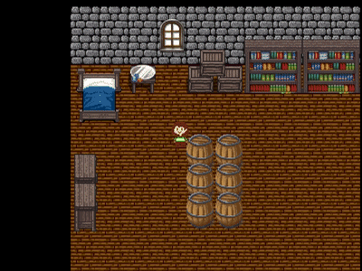

# GS2D Engine

<i>Game engine to create 2D games in C++ with SFML</i>

* * *

**GS2D Engine** aims to be a game engine for creating 2D games using SFML on the
C++ programming language. Most of the classes here are based on my another
project, [vulnus](https://github.com/murilobnt/vulnus), which is a 2D platform
game in development.

This tool will help you focus on the game. All you have to do is to create your
own scenes and to set up the main method.

## Requires

- [GCC](http://gcc.gnu.org) (7 or later).
- [SFML](https://www.sfml-dev.org).

## Installation

Read [Installation](https://github.com/murilobnt/gs2d_engine/blob/master/.github/installation/installation.md).

## Insight

- [Features and TO-DOs](https://github.com/murilobnt/gs2d_engine/blob/master/.github/features-todo.md).
- [Code comparison](https://github.com/murilobnt/gs2d_engine/blob/master/.github/comparison.md).
- [Wiki](https://github.com/murilobnt/gs2d_engine/wiki).

## Contributors

- [:cat: murilobnt](https://github.com/murilobnt) has created the GS2D Engine
and currently is the only developer of it.

## License

GS2D Engine is licensed under the [MIT License](https://github.com/murilobnt/gs2d_engine/blob/master/LICENSE).
