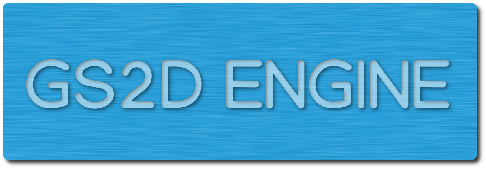

Game engine to create 2D games in C++ with SFML

* * *

## Description

**GS2D Engine** aims to be a game engine for creating 2D games using SFML on the C++ programming language. Most of the classes here are based on my another project, [vulnus](https://github.com/murilobnt/vulnus), which is a 2D platform game in development.

This tool will help you focus on the game. All you have to do is to create your own scenes and to set up the main method.

> Note check out the [wiki](https://github.com/murilobnt/wiki) for compiling instructions.
>
> Note: All lion pictures used by this readme were downloaded from <http://pngimagesfree.com>.

## Requires

### Essential (Engine related)

-   [GCC](http://gcc.gnu.org).
-   [SFML](https://www.sfml-dev.org).

### Optional (Tests related)

-   [Google Test](https://github.com/google/googletest)
-   [LCOV](http://ltp.sourceforge.net/coverage/lcov.php)

## Installation

You first need to clone or download the ZIP of this repository.

Both GCC and SFML can be installed in Debian/Debian based by entering the following commands at the terminal.

    sudo apt install gcc
    sudo apt install libsfml-dev

More information about it can be found at [this page of the wiki](https://github.com/murilobnt/gs2d_engine/wiki/Insight:-Starting-point).

## Usage

Compile the engine by entering, at the root of the project:

    make

And code your project under the directory _your_project_. You can choose to select another directory for your project, but it needs to use the _gs2d.a_ file under _gs2d/lib_ when compiling it.

More information about it can be found at [this page of the wiki](https://github.com/murilobnt/gs2d_engine/wiki/Tutorial:-The-first-step) and the following ones.

## Tutorials and documentation

Tutorials and documentation are available at the [wiki](https://github.com/murilobnt/gs2d_engine/wiki).

## Features and TO-DOs

| Feature              | % Functional | % Documented | Seen in execution  | Tested             |
| -------------------- | ------------ | ------------ | ------------------ | ------------------ |
| Game cycle control   | 100%         | 100%         | :heavy_check_mark: | :heavy_check_mark: |
| Makefile             | 100%         | 60%          | :heavy_check_mark: | ------             |
| Timed events control | 95%          | 100%         | :heavy_check_mark: | :heavy_check_mark: |
| Scene handling       | 90%          | 100%         | :heavy_check_mark: | **Partially**      |
| Game entities        | 70%          | 100%         | :heavy_check_mark: | :x:                |
| Tutorial             | 50%          | ------       | ------             | ------             |
| Default scenes       | 30%          | 0%           | :heavy_check_mark: | :x:                |
| Game components      | 10%          | 0%           | :x:                | :x:                |
| Scene transitions    | 0%           | 0%           | :x:                | :x:                |

## Stage

## Contributors

-   [:cat: Murilo Bento](https://github.com/murilobnt) has created the GS2D_Engine and currently is the only developer and tester of it.
