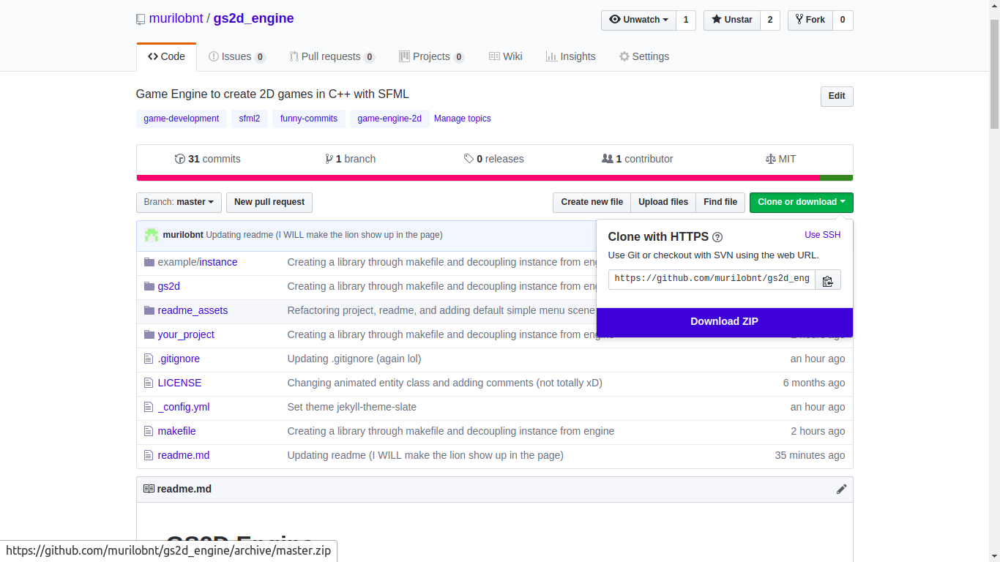

# Tutorial - Where the heck do I start?

Alright, here we are: You casually looked through the project and
haven't done anything with it yet. If this is your situation, fear not!
We'll go through this, step by step.

So, the first things you want to do is:

-   Download this repo.
-   Install its dependencies.

Simple, huh? Depends, heh.

## Download this repository

### [ZIP](https://github.com/murilobnt/gs2d_engine/archive/master.zip)

You can click this section's name to download this project's ZIP. It will be
the same as clicking the "Download ZIP" button as shown the screenshot :D.

<p align="center"></p>

### GIT clone

You can get this repository by pulling it with GIT. This part of the tutorial
will require you to go to the terminal. If you need help with it, this  [article](https://www.digitalocean.com/community/tutorials/basic-linux-navigation-and-file-management)
may be able to help you with it.

-   Install GIT, if you don't have it installed.

   ```
   sudo apt install git
   ```
-   Then, clone the project in a directory you want it to be.

   ```
   git clone https://github.com/murilobnt/gs2d_engine.git
   ```

And... donezo!

## Install dependencies

This project, as shown in the main readme, has three dependencies.

-   [GCC](http://gcc.gnu.org).
-   [SFML](https://www.sfml-dev.org).
-   [CxxTest](https://cxxtest.com).

Through terminal, you can do the following to install them:

```
sudo apt install g++
sudo apt install libsfml-dev
sudo apt install cxxtest
```

Terminal usually makes life simple.

# Where do we go from here?

#### [Next: Understanding some concepts](/tutorials/linux/understanding)

#### [Table of Contents / Home](https://github.com/murilobnt/gs2d_engine#tutorial)
