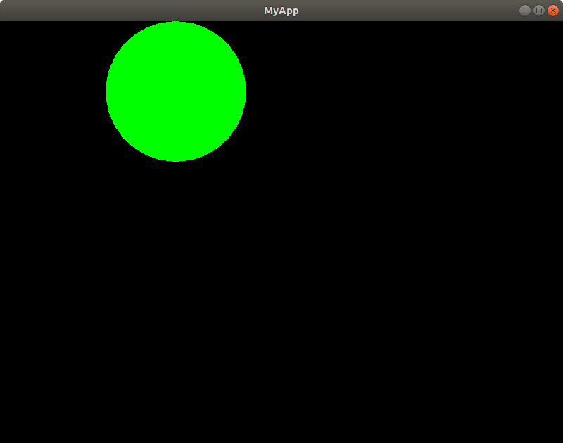

# Tutorial - Time handling

> Note: You need the SFML example we implemented last
tutorial to make this work.

So, here is something we want to do. Suppose we now want
to make our big green circle to move some space to it's
right, **but only every two seconds**. How much work will
we have to do that?

Spoiler: Fear not! TimeHandlers are here to make our lives
easier :D.

This is the content of this tutorial.

   * TimeHandlers: What and why?
   * Adding TimeHandlers.
   * Let's do it!
   * The result.

## TimeHandlers: What and why?

### What

**TimeHandler** is an object you can use to control timed
events of your scene. It works alongside the **ClockHandler**,
which is a member of **Game**.

Here's what you can do with it.

   * Set the updating rate of the time handler, through
   constructor.
   * Check if it's time to update something.

There are still some other stuff you can call, but you don't really need to
bother with them in normal situations.

In other words...

   ```
   TimeHandler(sf::Time update_rate);
   bool time_to_update();
   ```

### Why

Time handling in "raw" C++ SFML applications can be some trouble (I've done
so many wrong things before I knew how it works). These are some things it
can happen:

   * Bloated code, leading to lower maintainability.
   * More sf::Clock instances than needed.
   * Code replication. Different time handling segments are, pretty much,
   handled with the same code structure.

## Adding TimeHandlers

Every **Scene** has a vector of time handlers. The time handlers in this
vector are, by the *reset_time_handlers(ClockHandler &clock_handler)* method,  
already reseted by it. Knowing that, we have two options. Regardless of the
option, we create a **TimeHandler** as a member function. Then:

   1. we only add a reference to our **TimeHandler** to the *time_handlers*
   vector, in the *start()* method of the scene and that's all.
   2. we implement *reset_time_handlers(ClockHandler &clock_handler)*, calling
   the method *clock_handler.restart_time_handler(<time_handler>)* for every
   time handler.

I prefer the first option, hehe.

## Let's do it!

Enough talk. Remember **MyScene**? Let's go back to it.

Here's what we're going to do. Let's:

   * add a TimeHandler of **2 seconds** of update rate.
   * move the circle when 2 seconds have passed by.

Simple, right? This is how your **my_scene.hpp** and **my_scene.cpp** gotta be.

### my_scene.hpp

```
#ifndef MY_SCENE_HPP
#define MY_SCENE_HPP

#include <SFML/Graphics.hpp>

#include "gs2d_engine/concrete/time_handler.hpp"
#include "gs2d_engine/abstract/scene.hpp"

class MyScene : public Scene {

private:
    sf::CircleShape circle;

    TimeHandler circle_movement_th; // only this + include line were added

public:
    void start();
    void update();

    void handle_event(sf::Event event, sf::RenderWindow& screen);
    void draw_entities(sf::RenderWindow& screen);

};

#endif
```

### my_scene.cpp

```
#include "my_scene.hpp"

void MyScene::start(){
   circle = sf::CircleShape(100.f);
   circle.setFillColor(sf::Color::Green);

   circle_movement_th = TimeHandler(sf::seconds(2)); // create an instance
   time_handlers.push_back(&circle_movement_th); // add it to the vector of scene
}

void MyScene::update(){
    // check if it's time to move
    if(circle_movement_th.time_to_update())
        circle.move(sf::Vector2f(5, 0)); // move
}

void MyScene::handle_event(sf::Event event, sf::RenderWindow& screen){

}

void MyScene::draw_entities(sf::RenderWindow& screen){
   screen.draw(circle);
}
```

## The result

Compile your project (*make* in *your_project*). The result might go like this.
The following screenshots shows the initial (< 2 seconds runtime) state of the
application and the state after some pairs of seconds, respectively.

<p align="center">


</p>

Yay! We did it.

# Where do we go from here?

#### [Table of Contents / Home](https://github.com/murilobnt/gs2d_engine#tutorial)
